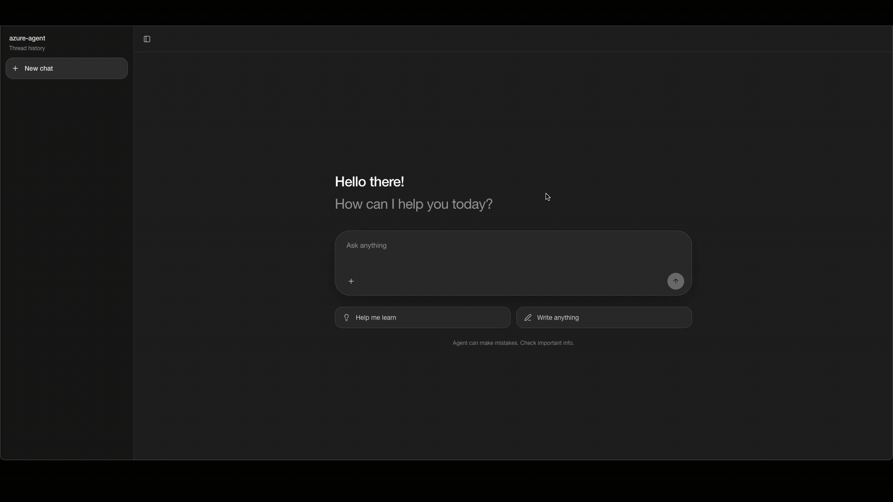
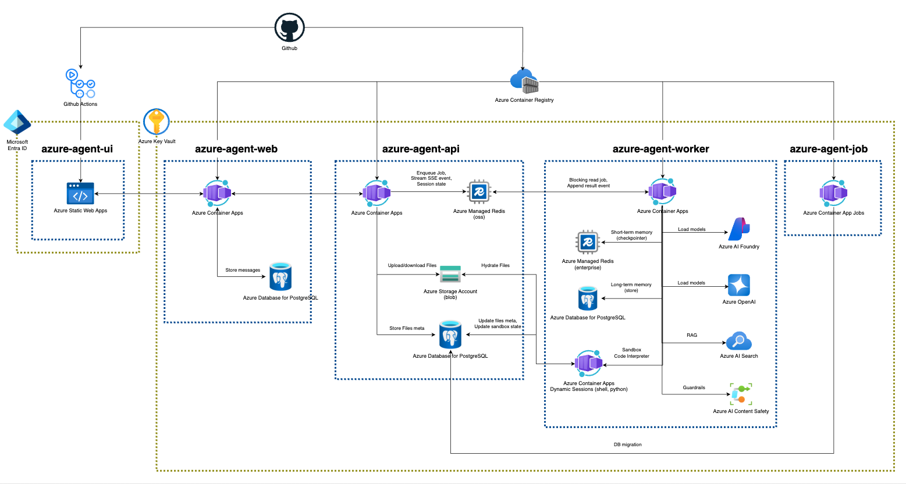

<h1 align="center">Azure Agent</h1>

<p align="center">
  Enterprise-Grade AI Chat Agent Template on Azure
</p>

<p align="center">
  <a href="LICENSE"></a>
  
</p>

<p align="center">
  
</p>

## Architecture

> [!NOTE]
> This service consists of five deployment units: `azure-agent-ui`, `azure-agent-web`, `azure-agent-api`, `azure-agent-worker`, and `azure-agent-job`. The `ui` and `web` units provide the frontend-facing layer, while the `api` and `worker` units run the core AI agent runtime. `job` unit used for database migrations via Alembic.

<p align="center">
  
</p>

---

## Quickstart
> Recommended Terraform-first deployment flow. For the full resource inventory, see [Azure Resources](#azure-resources).
> Helper scripts read Terraform outputs automatically. For script options, see [`scripts/README.md`](./scripts/README.md).

<details>
<summary>1. Provision Base Azure Resources</summary>

> The first Terraform apply creates the shared Azure resources only. Container Apps and the migration job are deployed later, after images, secrets, Langfuse, and auth settings are ready.

1.1 Configure Terraform variables
```bash
cd environments/infra
cp terraform.tfvars.example terraform.tfvars
```

Keep runtime services disabled for the first apply:
```hcl
deploy_container_apps    = false
deploy_container_app_job = false
```

Optionally enable Azure OpenAI model deployments if your subscription and region support the configured models:
```hcl
create_openai_deployments = true
```

1.2 Apply base infrastructure
```bash
terraform init
terraform plan
terraform apply
```

1.3 Review Terraform outputs
```bash
terraform output
```

The following steps use these outputs directly or through helper scripts.

</details>

<details>
<summary>2. Deploy Langfuse on Azure VM</summary>

> For demo use, Langfuse can be self-hosted on an Azure VM. For enterprise production use, we recommend running Langfuse on Kubernetes with managed dependencies, backups, monitoring, and network controls.

Use the optional Langfuse VM Terraform stack:
```bash
cd ../langfuse-vm
cp terraform.tfvars.example terraform.tfvars
```

Set `resource_group_name` to the output from the base infrastructure stack, and restrict access with `allowed_source_ip_ranges`:
```hcl
resource_group_name       = "<core-resource-group-name>"
allowed_source_ip_ranges = ["<your-client-ip>/32"]
```

Deploy the VM:
```bash
terraform init
terraform plan
terraform apply
```

Then follow the Langfuse VM guide to install Docker, start Langfuse, and create API keys:
- [`environments/langfuse-vm/README.md`](./environments/langfuse-vm/README.md)

Capture the Langfuse URL:
```bash
terraform output -raw langfuse_url
```

Store the generated public and secret keys as `LANGFUSE-PUBLIC-KEY` and `LANGFUSE-SECRET-KEY` during the secrets step. Use the `langfuse_url` output later as `LANGFUSE_BASE_URL` in `worker_extra_env`.

Return to the repository root for the remaining steps:
```bash
cd ../..
```

</details>

<details>
<summary>3. Configure App Registrations</summary>

> Create Microsoft Entra App Registrations for `azure-agent-ui` sign-in and `azure-agent-web` JWT access token validation. These values are needed before deploying `azure-agent-web`.

Create two single-tenant app registrations:

- `azure-agent-web-api`: expose an API scope named `access_as_user`.
- `azure-agent-ui`: set the redirect URI to `https://<your-static-web-app-domain>` and grant delegated permission to `azure-agent-web-api/access_as_user`.

Capture these values for the runtime Terraform apply and UI deployment:
```env
AZURE_AUTH_TENANT_ID=<your-directory-tenant-id>
AZURE_AUTH_API_CLIENT_ID=<your-api-app-registration-client-id>
AZURE_AUTH_REQUIRED_SCOPE=access_as_user
NEXT_PUBLIC_AZURE_TENANT_ID=<your-directory-tenant-id>
NEXT_PUBLIC_AZURE_CLIENT_ID=<your-ui-app-registration-client-id>
NEXT_PUBLIC_AZURE_API_SCOPE=api://<your-api-app-registration-client-id>/access_as_user
```

</details>

<details>
<summary>4. Configure Azure Key Vault Secrets</summary>

> Store the values defined in [`.env.keyvault`](./environments/env/.env.keyvault) as secrets in Azure Key Vault. Terraform creates the Key Vault and wires Container App secret references, but it does not write application secret values to avoid storing them in Terraform state.

Naming convention:
- Key Vault secret name: `AZURE-OPENAI-API-KEY`
- Container App secret key: `azure-openai-api-key`
- Runtime environment variable: `AZURE_OPENAI_API_KEY`

Bootstrap the required secrets:
```bash
scripts/bootstrap-secrets.sh --infra-dir environments/infra
```

The script reads Terraform outputs, fetches Azure resource keys where possible, prompts for values that cannot be inferred, and writes all required application secrets to Key Vault.
It requires `terraform`, `az`, and `jq`.

For more details, see:
- [`environments/env/.env.keyvault`](./environments/env/.env.keyvault)
- [`environments/env/README.md`](./environments/env/README.md)

</details>

<details>
<summary>5. Configure Azure AI Search</summary>

Create the Azure AI Search index and upload sample documents.

> This repository provides an example Azure AI Search configuration using Microsoft Learn documentation as a sample RAG data source. In production, replace it with your own schema and data. For more details, see [`examples/azure_ai_search/README.md`](./examples/azure_ai_search/README.md).

```bash
scripts/setup-azure-ai-search.sh --infra-dir environments/infra
```

</details>

<details>
<summary>6. Configure Blob Storage Prompts</summary>

Upload prompt files to Azure Blob Storage.

> The repository includes example prompt files. For production use, replace them with your own files using the same blob names.

```bash
scripts/upload-prompts.sh --infra-dir environments/infra
```

</details>

<details>
<summary>7. Build and Push Container Images</summary>

> For more details, see [`environments/deploy/README.md`](./environments/deploy/README.md).

Build and push the Python runtime image and the web image.
```bash
scripts/build-push-images.sh --infra-dir environments/infra
```

</details>

<details>
<summary>8. Deploy Runtime Services</summary>

> The second Terraform apply creates `azure-agent-api`, `azure-agent-worker`, `azure-agent-web`, and `azure-agent-job`. Container App secret references are created from the Key Vault references defined in Terraform.

Before applying, update `terraform.tfvars`:
```hcl
deploy_container_apps    = true
deploy_container_app_job = true

worker_extra_env = {
  LANGFUSE_BASE_URL = "<terraform-output-langfuse-url>"
}

web_extra_env = {
  AZURE_AUTH_TENANT_ID       = "<your-directory-tenant-id>"
  AZURE_AUTH_API_CLIENT_ID   = "<your-api-app-registration-client-id>"
  AZURE_AUTH_REQUIRED_SCOPE  = "access_as_user"
}
```

Apply runtime infrastructure:
```bash
cd environments/infra
terraform plan
terraform apply
```

Run the migration job after it is created:
```bash
az containerapp job start \
  --resource-group "$(terraform output -raw resource_group_name)" \
  --name "$(terraform output -json resource_names | jq -r .container_app_job)"
```

Return to the repository root:
```bash
cd ../..
```

</details>

<details>
<summary>9. Deploy UI</summary>

> Terraform creates the Azure Static Web Apps resource. The UI still needs a GitHub Actions deployment. For more details, see [`apps/README.md`](./apps/README.md).

Set the GitHub Actions secret:
```env
AZURE_STATIC_WEB_APPS_API_TOKEN=<azure-agent-ui-deployment-token>
```

You can get the deployment token from Terraform:
```bash
terraform -chdir=environments/infra output -raw static_web_app_api_key
```

You can get the web URL from Terraform:
```bash
terraform -chdir=environments/infra output -json container_app_urls | jq -r .web
```

Set the GitHub Actions variables:
```env
NEXT_PUBLIC_AGENT_WEB_URL=<azure-agent-web-application-url>
NEXT_PUBLIC_AZURE_TENANT_ID=<your-directory-tenant-id>
NEXT_PUBLIC_AZURE_CLIENT_ID=<your-ui-app-registration-client-id>
NEXT_PUBLIC_AZURE_API_SCOPE=api://<your-api-app-registration-client-id>/access_as_user
```

Deploy via GitHub Actions:
```bash
git push origin main
```

</details>

<details>
<summary>10. Check Service Status</summary>

> For more details, see [`README.md`](./src/azure_agent/api/README.md).

Check `azure-agent-api`:
- `https://<azure-agent-api-url>/agent/api/ping`
- `https://<azure-agent-api-url>/agent/api/health`
- `https://<azure-agent-api-url>/agent/swagger`

Check `azure-agent-web`:
- `https://<azure-agent-web-url>/health`

Check `azure-agent-ui`:
- `https://<azure-agent-ui-url>`

</details>

---

## Azure Resources

| Resource | Notes |
| --- | --- |
| Azure OpenAI | Deploy `gpt-5.4-nano`, `text-embedding-3-large` |
| Azure AI Foundry | Deploy `gpt-5.4` |
| Azure AI Search | [Create and Upload Document](./examples/azure_ai_search/README.md) |
| Azure AI Content Safety | - |
| Azure Managed Redis (Enterprise) | Required modules: `RedisJSON`, `RedisSearch` |
| Azure Managed Redis (OSS) | - |
| Azure Database for PostgreSQL | - |
| Azure Storage Account (Blob) | Create `files`, `prompts` container |
| Azure Container Apps | Deploy `azure-agent-api` service |
| Azure Container Apps | Deploy `azure-agent-worker` service |
| Azure Container Apps | Deploy `azure-agent-web` service |
| Azure Container Apps Environment | - |
| Azure Container Registry | - |
| Azure Static Web Apps | Deploy `azure-agent-ui` service |
| Azure Virtual Machines | Deploy `langfuse` service |
| Azure Container App Job | Trigger type: `Manual`, Run `azure-agent-job` |
| Azure Container Apps Session Pool | Pool type: `Python` |
| Azure Container Apps Session Pool | Pool type: `Shell` |
| App Registrations | Register `azure-agent-ui`,`azure-agent-web-api` |
| Azure Key Vault | [Generate Secrets](./environments/env/README.md) |
| Log Analytics Workspace | - |

---

## Project Structure

```text
azure-agent/
├── .github/workflows/         # GitHub Actions workflow
├── apps/
│   ├── azure-agent-ui/        # Next.js frontend (chat UI)
│   └── azure-agent-web/       # Fastify web gateway (auth, threads, files, proxying)
├── docs/                      # Documents (diagrams, videos, icons)
├── environments/
│   ├── deploy/                # Docker files
│   ├── env/                   # Key Vault secret template and setup notes
│   ├── infra/                 # Core Terraform templates (public network ver.)
│   └── langfuse-vm/           # Optional Langfuse VM Terraform stack
├── examples/
│   └── azure_ai_search/       # Azure AI Search indexing and retrieval examples
├── scripts/                   # Deployment helper scripts
├── src/
│   └── azure_agent/
│       ├── api/               # FastAPI server
│       ├── backends/          # Runtime backend adapters
│       ├── config/            # Runtime config and environment settings
│       ├── database/          # Database migration setup and Alembic revisions
│       ├── encoder/           # Bundled tiktoken cache files for air-gapped environments
│       ├── files/             # File metadata schemas and persistence helpers
│       ├── graphs/            # LangGraph agent construction and execution flow
│       ├── infra/             # Redis and shared infrastructure helpers
│       ├── jobs/              # Redis Stream job queue and event persistence
│       ├── memories/          # Agent memory files
│       ├── middlewares/       # Custom agent/runtime middleware
│       ├── prompts/           # Agent prompts
│       ├── session/           # Thread session ownership, locking, and job coordination
│       ├── skills/            # Agent skills
│       ├── tools/             # Agent tools
│       └── worker/            # Background worker that consumes jobs and runs the graph
├── package.json               # pnpm workspace root
├── pnpm-workspace.yaml        # pnpm workspace definition
├── pnpm-lock.yaml             # JavaScript dependency lockfile
├── pyproject.toml             # Python package metadata
└── uv.lock                    # Python dependency lockfile
```

---

## Service Features

| Category | Library | Resource |
| --- | --- | --- |
| RAG | [Azure AI Search](https://learn.microsoft.com/en-us/azure/search) | Azure AI Search |
| Web Search | [Web search](https://learn.microsoft.com/en-us/azure/foundry/openai/how-to/web-search) | Azure OpenAI (Grounding with Bing Search) |
| Sandbox Environment | [SessionsBashBackend](https://learn.microsoft.com/en-us/azure/container-apps/sessions) | Azure Container Apps Session Pool (shell) |
| Code Interpreter | [SessionsPythonREPLTool](https://learn.microsoft.com/en-us/azure/container-apps/sessions) | Azure Container Apps Session Pool (python) |
| Short-term Memory | [AsyncShallowRedisSaver](https://docs.langchain.com/oss/python/langgraph/add-memory#example-using-redis-checkpointer) | Azure Managed Redis (Enterprise) |
| Long-term Memory | [AsyncPostgresStore](https://docs.langchain.com/oss/python/langgraph/add-memory#example-using-postgres-store), [MemoryMiddleware](https://docs.langchain.com/oss/python/deepagents/memory) | Azure Database for PostgreSQL |
| Skills | [SkillsMiddleware](https://docs.langchain.com/oss/python/deepagents/skills) | Azure Database for PostgreSQL |
| Context Management | [SummarizationMiddleware](https://reference.langchain.com/python/langchain/agents/middleware/summarization/SummarizationMiddleware) | Azure OpenAI |
| Agent Orchestration | [SubAgentMiddleware](https://reference.langchain.com/python/deepagents/middleware/subagents/SubAgentMiddleware) | - |
| Task Management | [TodoListMiddleware](https://reference.langchain.com/python/langchain/agents/middleware/todo/TodoListMiddleware) | Azure Managed Redis (Enterprise) |
| File Management | [FilesystemMiddleware](https://reference.langchain.com/python/deepagents/middleware/filesystem/FilesystemMiddleware) | Azure Database for PostgreSQL |
| Rate Limiting | [ModelCallLimitMiddleware](https://reference.langchain.com/python/langchain/agents/middleware/model_call_limit/ModelCallLimitMiddleware), [ToolCallLimitMiddleware](https://reference.langchain.com/python/langchain/agents/middleware/tool_call_limit/ToolCallLimitMiddleware) | - |
| Content Moderation | [AzureContentModerationMiddleware](https://learn.microsoft.com/en-us/azure/foundry/how-to/develop/langchain-middleware) | Azure AI Content Safety |
| Prompt Shield | [AzurePromptShieldMiddleware](https://learn.microsoft.com/en-us/azure/foundry/how-to/develop/langchain-middleware) | Azure AI Content Safety |
| PII | [PIIMiddleware](https://reference.langchain.com/python/langchain/agents/middleware/pii/PIIMiddleware) | - |
| Session Management | [Session Manager(Custom)](./src/azure_agent/session/README.md) | Azure Managed Redis (OSS) |
| Stream Management(Job/Worker) | [Redis Streams](https://redis.io/docs/latest/develop/data-types/streams) | Azure Managed Redis (OSS) |
| Real-time interaction | [Streaming](https://docs.langchain.com/oss/python/langgraph/streaming), [SSE](https://fastapi.tiangolo.com/tutorial/server-sent-events) | Azure Managed Redis (OSS) |
| Prompt Management | [azure-storage-blob](https://github.com/Azure/azure-sdk-for-python/tree/main/sdk/storage/azure-storage-blob) | Azure Blob Storage |
| Secret Management  | Azure Container Apps secret references | Azure Key Vault |
| UI | [assistant-ui](https://github.com/assistant-ui/assistant-ui), [tool ui](https://www.tool-ui.com/) | Azure Static Web Apps  |
| Authentication | [MSAL/JWT](https://learn.microsoft.com/ko-kr/entra/msal/python/) | Microsoft Entra ID, App Registration  |
| Observability | [Langfuse](https://github.com/langfuse/langfuse) | Azure Virtual Machine or Azure Kubernetes Service, ... |

---

## License
> This project is licensed under the [Apache License 2.0](./LICENSE).

Bundled `Swagger UI static`, `Tiktoken cache`, `OpenAI Skills` may require separate upstream license notice files during redistribution. If you update or re-bundle these assets, include all required third-party notices in the distributed package.
